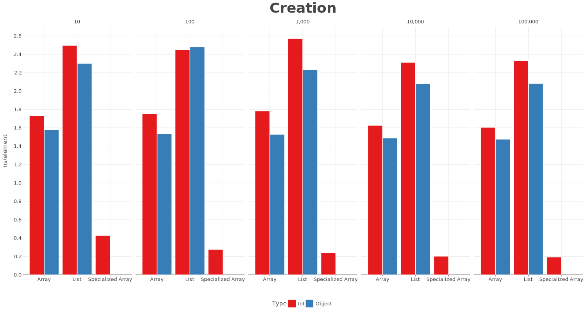

# Sequence Benchmarks

This repository contains benchmarks of different collection operators implemented using `List`s, `Sequence`s, `Array`s, specialized `Array`s and progressions.

Benchmarks use [JMH](https://github.com/openjdk/jmh/blob/master/README.md) and were run on MacBook M2 Max.

## Results

